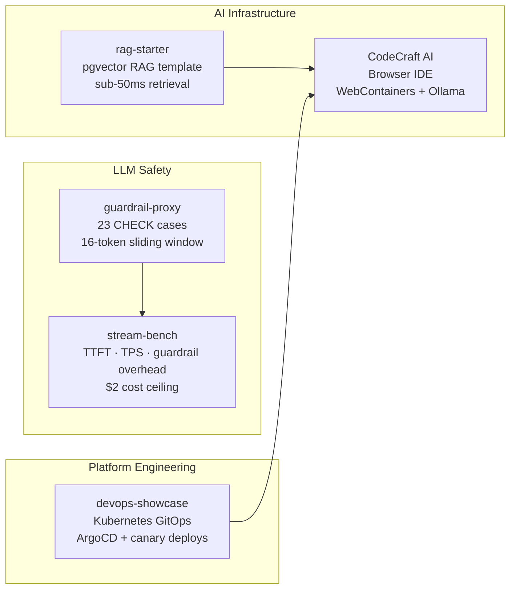

# Hi, I'm Lakshyaraj 👋

**Full-Stack Developer (Backend + Platform Engineering)** · BTech CCE, Manipal University Jaipur · Bangalore, India · Open to fresher/junior roles · MIT License

---

## What I'm building

Solo CTO of [Homesty.ai](https://homesty.ai) — an AI-powered real estate platform. I built every layer: streaming GPT-4o chat with runtime guardrails (abort mid-generation on policy violations), pgvector RAG with sub-50ms retrieval, a 7-module decision engine, and a full admin system. 165 production deploys.

The open-source work below shows the pieces in detail.

---

## The repos

| Project | What it proves | Stack |
|---------|----------------|-------|
| **[guardrail-proxy](https://github.com/ykstorm/guardrail-proxy)** | LLM safety systems — 23 regex-based CHECK cases, streaming mid-abort, partial delivery guarantee | TypeScript · Vitest · NPM |
| **[stream-bench](https://github.com/ykstorm/stream-bench)** | Performance measurement rigor — TTFT, TPS, guardrail overhead, cost ceiling with JSON Lines ledger | TypeScript · OpenAI · Anthropic |
| **[rag-starter](https://github.com/ykstorm/rag-starter)** | RAG from production — 0.30 cosine floor, adaptive K (6/10), idempotent upsert, extracted from Homesty.ai buyerchat | Next.js · Prisma · pgvector |
| **[devops-showcase](https://github.com/ykstorm/devops-showcase)** | Kubernetes platform engineering — kind cluster, ArgoCD app-of-apps, canary deploys + auto-rollback, full observability stack | Kubernetes · ArgoCD · Helm · Prometheus |
| **[CodeCraft AI](https://github.com/ykstorm/codecraft-ai)** | Browser-based IDE internals — WebContainers (real Node.js in browser via V8 Service Worker), Monaco Editor, xterm.js, 4-mode Ollama chat | Next.js · WebContainers · Docker |

---

## Stack

**Backend:** TypeScript · Next.js 15 · React 19 · Node.js · Prisma 7 · PostgreSQL/pgvector · Neon
**AI:** GPT-4o streaming · guardrails · RAG · Ollama local LLMs
**Platform:** Kubernetes · ArgoCD · Argo Rollouts · Prometheus · Loki · Tempo · Grafana
**DevOps:** GitHub Actions · Docker · Docker Compose · kind · Helm

---

## Status

- 🔍 **Open to:** Fresher / Junior Full-Stack Developer, Backend Engineer, or Platform Engineering roles (India/Remote)
- 🎓 **Education:** BTech Computer Communication Engineering (8th Semester), Manipal University Jaipur
- 📍 **Location:** Jaipur, India
- 📧 **Reach:** [raolakshyaraj@gmail.com](mailto:raolakshyaraj@gmail.com) · [linkedin.com/in/lakshyarajsinghrao](https://linkedin.com/in/lakshyarajsinghrao)

---

  

