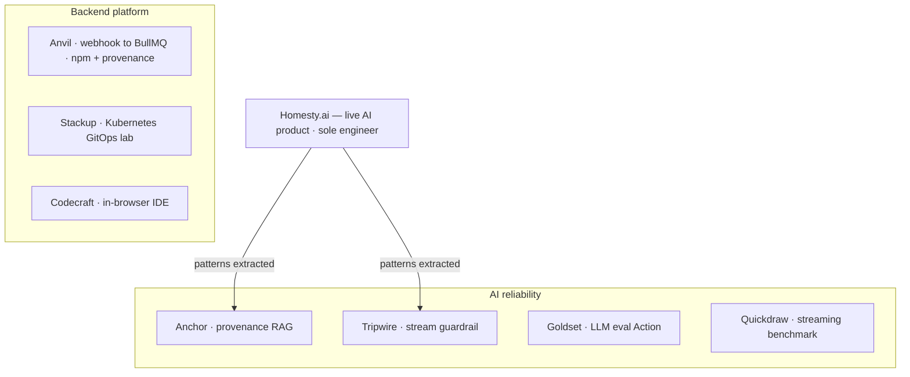

# Lakshyaraj Singh Rao

**Backend Engineer · AI Infrastructure · DevOps** — Mumbai, India

> I build the reliability layer that lets AI run in production without supervision — refusal when retrieval fails, an abort when output goes off-script, eval-gating before merge, idempotency under webhook re-delivery.

[](https://lakshyaraj-dev.vercel.app)
[](https://www.npmjs.com/~ykstormsorg)
[](https://linkedin.com/in/lakshyaraj-singh-rao-840273152)
[](mailto:raolakshyaraj@gmail.com)

**Four npm packages** (one with SLSA build provenance) · a **GitHub Marketplace Action** · **seven open-source repos**, each with a live demo and green CI — every one extracted from a live, solo-built AI product.

<!-- Rendered to PNG so it shows on the GitHub mobile app and in dark mode,
     where ```mermaid blocks don't render. Source kept in <details> below. -->


<details>
<summary>Diagram source (Mermaid)</summary>



</details>

## Selected open source

| Project | What it solves | Links |
|---|---|---|
| **Anvil** | A re-delivered Stripe/GitHub webhook double-fires your worker. Anvil is the idempotent webhook → BullMQ pipeline that dedupes, retries on a fixed backoff, and dead-letters with replay. Constant-time HMAC verify. Terraform module + Helm chart. | [repo](https://github.com/ykstorm/anvil) · [npm](https://www.npmjs.com/package/@ykstormsorg/anvil) · _SLSA provenance_ |
| **Anchor** | RAG that refuses instead of hallucinating — returns `refused: true` when nothing clears the cosine floor, with a provenance trail on what it does return. | [repo](https://github.com/ykstorm/anchor) · [playground](https://anchor-iota-ten.vercel.app/playground) |
| **Tripwire** | Mid-stream LLM guardrail that kills the response on a rule trip *before* the bad token reaches the user. Drop in as an OpenAI-compatible proxy (one URL) or a library. | [repo](https://github.com/ykstorm/tripwire) · [npm](https://www.npmjs.com/package/@ykstormsorg/tripwire) |
| **Goldset** | CI for AI — golden-dataset + LLM-judge + structural eval runners as a GitHub Action that posts a delta-vs-base PR comment and blocks the merge on regression. | [repo](https://github.com/ykstorm/goldset) · [marketplace](https://github.com/marketplace/actions/goldset-ai-eval-gate) · [npm](https://www.npmjs.com/package/@ykstormsorg/goldset) |
| **Quickdraw** | LLM streaming benchmark CLI — TTFT, tokens/sec, p50/p95/p99, and cost per 1K across OpenAI + Anthropic, with `quickdraw diff` for regressions. | [repo](https://github.com/ykstorm/quickdraw) · [npm](https://www.npmjs.com/package/@ykstormsorg/quickdraw) · _SLSA provenance_ |
| **Stackup** | Production-shape Kubernetes on your laptop — ArgoCD app-of-apps + Argo Rollouts canary with a real Prometheus success-rate gate + kube-prometheus-stack, from one `make up`. | [repo](https://github.com/ykstorm/stackup) · [docs](https://ykstorm.github.io/stackup/) |
| **Codecraft** | In-browser IDE that boots a real Vite + React dev server in the tab via WebContainers — editable Monaco, live `npm install` in an xterm, snapshot-cached boots. | [repo](https://github.com/ykstorm/codecraft-ai) · [live](https://codecraft-ai-tau.vercel.app) |

On npm: [**@ykstormsorg**](https://www.npmjs.com/~ykstormsorg) — anvil, tripwire, goldset, quickdraw.

## Day job

Sole engineer on [**Homesty.ai**](https://homesty.ai) — a live buyer-side real-estate AI on Next.js 15 + Postgres/pgvector + Prisma + GPT-4o + Claude. Refusal-first retrieval and a mid-stream guardrail were hardened out of this work into Anchor and Tripwire — same engine, made public.

## Stack

**Backend** TypeScript · Node 20 · Postgres + pgvector · Prisma · Redis · BullMQ
**AI** OpenAI · Anthropic · RAG · LLM streaming · prompt-injection defense · evals
**Infra** Docker · Kubernetes (kind, ArgoCD, Argo Rollouts) · Helm · Terraform · Vercel
**Observability** Sentry · Prometheus · Grafana

## Open to

Backend-platform / AI-infrastructure / DevOps roles — remote-first, Bangalore or Mumbai startups, YC seed-stage founding engineer, or contract work on RAG, streaming LLM, and queue/webhook reliability.

📍 [lakshyaraj-dev.vercel.app](https://lakshyaraj-dev.vercel.app)  ·  📧 raolakshyaraj@gmail.com
