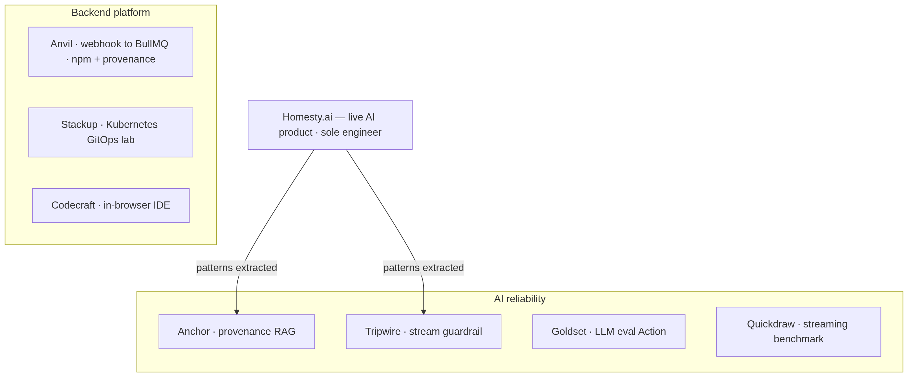
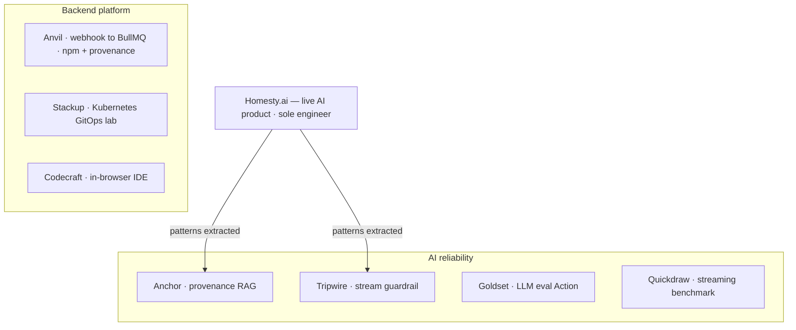

# Lakshyaraj Singh Rao

Backend engineer · AI infrastructure · DevOps · Mumbai, India

I build the libraries I needed while shipping AI products that couldn't lie to users.

**4 npm packages** (one published with build provenance) · a **GitHub Marketplace Action** · **7 open-source repos**, each with a live demo and green CI.

<!-- Rendered to PNG so it shows on the GitHub mobile app and in dark mode,
     where ```mermaid blocks don't render. Source kept in <details> below. -->


<details>
<summary>Diagram source (Mermaid)</summary>



</details>

## Open source

- 🔨 [**Anvil**](https://github.com/ykstorm/anvil) — Idempotent webhook → BullMQ worker pipeline. HMAC-SHA256 constant-time verify, dedupe, backoff `[1s, 5s, 30s, 5m]`, dead-letter replay. Ships with a Terraform module and a Helm chart. On [npm](https://www.npmjs.com/package/@ykstormsorg/anvil) with **build provenance**.
- 🪨 [**Anchor**](https://github.com/ykstorm/anchor) — Provenance-first RAG with cosine-floor refusal: returns `refused: true` instead of guessing when no source clears the floor. [Live playground](https://anchor-iota-ten.vercel.app/playground).
- ⚡ [**Goldset**](https://github.com/ykstorm/goldset) — Three-runner AI eval framework as a GitHub Action. PR comment diffs the delta, merge-blocks on regression. npm + Marketplace.
- 🚦 [**Tripwire**](https://github.com/ykstorm/tripwire) — Mid-stream LLM safety. Token-by-token rule engine, sub-millisecond abort on rule trip. Ships an OpenAI-compatible sidecar proxy that streams through the guard. npm.
- 📊 [**Quickdraw**](https://github.com/ykstorm/quickdraw) — LLM streaming benchmark CLI. TTFT, tokens/sec, $/1K. Nightly bench against OpenAI + Anthropic. npm.
- ☸️ [**Stackup**](https://github.com/ykstorm/stackup) — Production-shape Kubernetes locally in 10 minutes: ArgoCD app-of-apps + Argo Rollouts canary + kube-prometheus-stack via one `make up`. [Docs](https://ykstorm.github.io/stackup/).
- 💻 [**Codecraft**](https://github.com/ykstorm/codecraft-ai) — In-browser IDE that boots a real Vite + React dev server in the tab via WebContainers. Editable Monaco + interactive xterm + IndexedDB snapshot cache. [Live](https://codecraft-ai-tau.vercel.app).

On npm: [@ykstormsorg](https://www.npmjs.com/~ykstormsorg) — anvil, goldset, quickdraw, tripwire.

## Day job

Sole engineer on [Homesty.ai](https://homesty.ai) — a live buyer-side real-estate AI on Next.js 15 + Postgres/pgvector + Prisma + GPT-4o + Claude. Refusal-first retrieval and a mid-stream guardrail were extracted from this work into Anchor and Tripwire.

## Stack

Backend: TypeScript · Node 20 · Postgres + pgvector · Prisma · Redis · BullMQ
AI: OpenAI · Anthropic · RAG · LLM streaming · prompt-injection defense
Infra: Docker · Kubernetes (kind, ArgoCD, Argo Rollouts) · Terraform · Vercel
Observability: Sentry · Prometheus · Grafana

## Open to

Backend-platform / AI-infrastructure / DevOps roles — remote-first, Bangalore or Mumbai startups, YC seed-stage founding engineer, or contract work on RAG, streaming LLM, and queue/webhook reliability.

📍 [lakshyaraj-dev.vercel.app](https://lakshyaraj-dev.vercel.app) · 📧 raolakshyaraj@gmail.com · 🐦 [@ykstorm](https://x.com/ykstorm)
